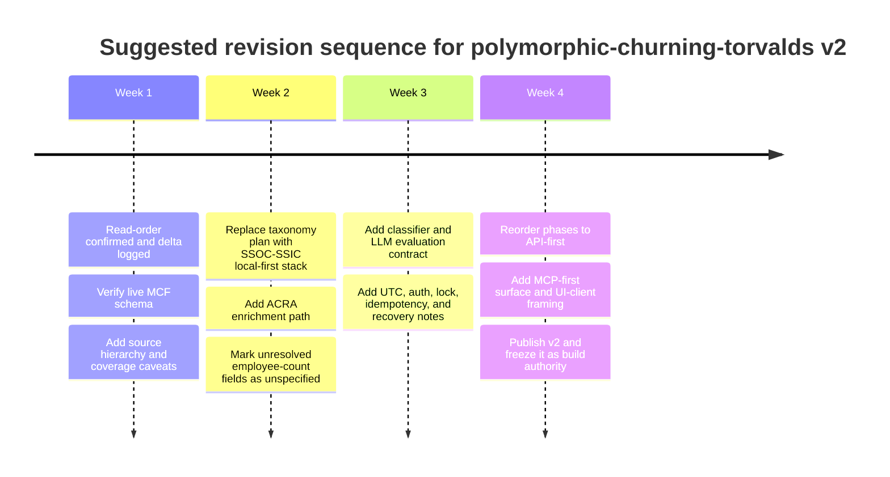

№ 1,001 - 13-05 '26 08:45 SGT

# Improving polymorphic-churning-torvalds

## Executive summary

Read order for this review was `polymorphic-churning-torvalds.md` first, then `development-plan.md`. On that basis, the first document is still the better conceptual foundation, while the second document should be treated as the execution delta that sharpens sequencing, surfaces, and model strategy. The right move is not to replace the first document, but to revise it into a versioned design memo that is explicitly marked as concept-first, schema-pending, and partially superseded by the later development plan. fileciteturn0file0L3-L6 fileciteturn0file0L10-L22 fileciteturn0file1L3-L17 [§1.1]

The most important improvements are sixfold. First, promote “verify the live MCF schema” from an open question into a hard gate. Second, make the source hierarchy more local and official: use entity["organization","Ministry of Manpower","singapore ministry"] vacancy statistics, entity["organization","SkillsFuture Singapore","statutory board singapore"] and entity["organization","Workforce Singapore","statutory board singapore"] jobs-skills datasets, and entity["organization","Accounting and Corporate Regulatory Authority","singapore regulator"] UEN-SSIC data as the deterministic backbone, with ESCO as fallback rather than first choice. Third, add a methodology warning that this is a view of the entity["organization","MyCareersFuture","singapore jobs portal"] channel, not a census of all hiring in entity["country","Singapore","island city-state"]. Fourth, add formal evaluation for the outsourcing classifier and the LLM interpretation layer. Fifth, harden cron, MCP, and run semantics around UTC scheduling, auth, concurrency, and idempotency. Sixth, align the document to the newer API-first direction so the web page is one surface, not the core product. fileciteturn0file0L64-L66 fileciteturn0file0L270-L286 fileciteturn0file1L21-L41 citeturn13view4turn8view0turn18search2turn11view0turn16view1turn19search0 [§1.2]

My bottom-line judgment is this: the first document is strategically strong, but it needs to become more explicit about provenance, bias, validation, and operational safety before it becomes the authoritative build brief. The improvements below are therefore mostly about tightening the design into something more testable, more locally grounded, and less likely to drift. fileciteturn0file0L184-L244 fileciteturn0file1L67-L82 citeturn13view1turn13view2turn13view3 [§1.3]

## What the first document already gets right

The first document gets four big things right and should keep them. It correctly treats the project as a standalone national labour-market layer rather than a per-role tab; it reuses the existing codebase instead of inventing new infrastructure; it separates deterministic market rollups from AI-generated interpretation; and it frames job postings as signals of capacity, capability, redesign opportunity, and structural change instead of lazily treating every vacancy as a simple headcount need. Those are strong design instincts and should survive the rewrite intact. fileciteturn0file0L19-L22 fileciteturn0file0L24-L60 fileciteturn0file0L145-L169 fileciteturn0file0L189-L244 [§2.1]

The document’s research thesis is also directionally sound against official labour-market context. The 2025 vacancy report from MOM says 49.3% of vacancies were newly created positions, specialist digital and engineering occupations remained in demand, and employers were not treating academic qualifications as the main determinant for hiring in 79.6% of vacancies. WSG’s JTMs likewise describe AI, automation, digitalisation, and sustainability as sector-level job-and-skill transformers, not just efficiency tools. So the document is right to centre “what work is changing?” rather than merely “which roles are numerous?”. citeturn13view1turn13view2 [§2.2]

| Preserve in the revision | Why it is worth keeping |
|---|---|
| Daily snapshot architecture | It is the cleanest basis for “new in window” logic and trend accrual. |
| Deterministic rollups before LLM synthesis | It keeps core counts auditable and cheap to recompute. |
| Outsourcing filter as a separate classifier | It matches the user intent without corrupting the raw market count. |
| Task-level “gap to agent” reasoning | It is a better unit of analysis than job-level automation claims. |

The table above reflects the strongest enduring parts of the first document and should become the “non-negotiables” section of a revised v2. fileciteturn0file0L99-L182 fileciteturn0file0L246-L268 [§2.3]

## What the second document materially changes

The second document makes three material corrections to the first. It inserts a Phase 0 verification gate before any build commitment, it changes the product order from “data layer then page” to “data layer then MCP then page”, and it formalises model tiering instead of implying one general `/api/claude` pattern for everything. It also sharpens the principle that each slice should be independently useful. Those are not cosmetic refinements; they should be folded back into the first document so that the conceptual brief and the delivery brief stop drifting apart. fileciteturn0file1L7-L17 fileciteturn0file1L21-L65 [§3.1]

| Topic | First document | Second document | Recommended merge |
|---|---|---|---|
| Entry condition | “Re-confirm live response before coding” is present, but not elevated | Phase 0 explicitly verifies schema before commitment | Make schema verification a hard precondition in the first document |
| First product surface | Standalone web page | MCP server first, web page second | Rewrite architecture as API-first with multiple surfaces |
| Model strategy | Reuse `/api/claude` and cache the big framework prompt | Explicit Haiku / Sonnet / Opus tiering | Keep tiering in the execution plan, not buried in implementation notes |
| Phase ordering | UI arrives before MCP | MCP arrives before UI | Reorder the first document’s phases to match the second |
| Cost framing | Implicitly cheap | Rough cost envelope stated | Add a bounded cost/risk note to the first document |

This comparison is drawn directly from the two source files, but the recommendation column is my synthesis of how to reconcile them cleanly. fileciteturn0file0L248-L268 fileciteturn0file1L21-L82 [§3.2]

The practical implication is simple: `polymorphic-churning-torvalds.md` should become the authoritative “why and what” document, while `development-plan.md` remains the authoritative “how and in what order” document. Right now, the line between them is too soft. A v2 revision should make that distinction explicit in front matter. fileciteturn0file0L3-L6 fileciteturn0file1L3-L5 [§3.3]

## Research-backed improvements to fold into the first document

The highest-priority change is to add a new “Representativeness and source hierarchy” subsection near the top. Current MOM guidance requires many Employment Pass and S Pass openings to be advertised on MCF for at least 14 consecutive days, and the MCF FAQ says the portal complements rather than replaces other job portals. My inference from those two official statements is that the product should describe itself as a labour-market view of the MCF channel, calibrated against official national indicators, not as a census of all hiring in Singapore. That wording matters because it protects the project from overclaiming. It also suggests one useful additional chart: posting-age distribution, since mandatory ad windows can visibly shape the composition of “live” ads. citeturn18search0turn18search2turn17view0turn13view1 [§4.1]

The second major change is to replace the current taxonomy stack with a local-first hierarchy. Section 2 of the first document currently treats SSOC as “if present” and points to ESCO for occupational rollups. A stronger design is: SSOC 2024 first, official SSOC-to-ISCO correspondence second, ESCO only as fallback enrichment when neither title nor raw payload yields enough occupation structure. That is the more faithful Singapore approach because SingStat states that SSOC 2024 is the national standard for occupations and already publishes correspondence tables to ISCO-08. On company enrichment, the document should stop treating UEN-to-sector lookup as an unknown and instead name the official `data.gov.sg` ACRA corporate-entities datasets as the primary path for UEN, SSIC, SSIC description, and entity status. Employee count, by contrast, should remain marked **unspecified** unless a live MCF response really exposes it. fileciteturn0file0L77-L95 citeturn13view4turn8view0 [§4.2]

The third change is to treat raw MCF skills as a weak signal, not a canonical one. The MCF FAQ explicitly says the platform’s displayed skills are identified via machine learning from job descriptions, while MySkillsFuture and the Skills Frameworks are built differently and use industry inputs. Meanwhile, the Jobs-Skills Portal says it provides datasets, dashboards, and algorithms linking industries, companies, jobs, skills, and wages. That means the revised document should say this plainly: use MCF skills for recall, trend discovery, and clustering, but normalise important skills analysis against Skills Framework or Jobs-Skills taxonomies where possible. This is one of the most valuable research-backed improvements because it reduces semantic drift in the “what gaps are employers trying to fill?” layer. citeturn17view0turn7search1turn7search4turn7search23 [§4.3]

The fourth change is to add an explicit evaluation harness. The first document already hints at caveats for the outsourcing classifier and AI-generated interpretation, but it does not define what “good enough” means. The revised document should add a “Measure and governance” section, borrowing the basic discipline of the entity["organization","National Institute of Standards and Technology","us standards agency"] AI RMF: govern, map, measure, manage. Concretely, that means defining acceptable limits for schema drift, null-rate tolerance for critical fields, precision-recall targets for the outsourcing classifier, factuality checks for LLM summaries, confidence labels on every gap claim, and evidence objects such as `metric_refs`, `sample_n`, and `source_refs`. No model-generated claim about a market gap should appear without a deterministic evidence trail. fileciteturn0file0L155-L167 citeturn19search0turn19search6turn19search8turn19search9 [§4.4]

The fifth change is operational. The first document’s cron plan is good, but it needs to be rewritten against the current official hosting docs. The platform docs say cron jobs are configured in `vercel.json`, always run on UTC schedules, can invoke overlapping runs, may occasionally deliver the same event more than once, do not retry failed invocations, and should be protected with `CRON_SECRET`. So the document should stop implying that “SGT-friendly” scheduling is self-explanatory and instead define two timestamps explicitly: `cron_invoked_at_utc` and `snapshot_date_sgt`. It should also require lock-based concurrency control, idempotent upserts, and a recoverable run ledger before Phase 1 is considered complete. One more small correction: the first document’s “Pro plan so crons are available” note is no longer the best framing, because the official docs now say cron jobs are available on all plans, with plan-specific limits and accuracy differences. fileciteturn0file0L50-L53 fileciteturn0file0L113-L121 citeturn11view1turn11view2turn11view0 [§4.5]

The sixth change is to harden the AI runtime section. The first document already uses cached prompts, which is sensible, but the revised version should document the trade-offs properly. The official model docs now distinguish Haiku 4.5, Sonnet 4.6, and Opus 4.7 more clearly by cost and capability; prompt caching has a 5-minute default TTL, supports a 1-hour option, and is eligible for ZDR; Message Batches reduce costs by 50% but are not ZDR-eligible. That implies a cleaner policy: keep the daily report on the normal Messages API plus prompt caching if privacy posture matters; use Message Batches only for backfills, large offline evaluations, or sector-by-sector historical regeneration where latency is irrelevant and retention is acceptable. In the document, model *tiers* should sit in the main text, but exact model IDs and prices should move to an appendix so the strategy ages more slowly. fileciteturn0file1L12-L14 citeturn12view1turn12view0turn12view2 [§4.6]

The seventh change is architectural neatness. The first document notes that the current `App.jsx` is around 8.6k lines, while the second document says that file size is already affecting one-off build cost and context size. So the revised design should explicitly ban further growth of the monolith. The authoritative product core should be the data layer plus the MCP-read surface, with the standalone web page treated as one client. If remote MCP is used, the official MCP spec also pushes the design toward proper authentication, `Origin` validation, and session handling on Streamable HTTP. This is not “gold plating”; it is simply the difference between a promising prototype and a clean platform seam. fileciteturn0file0L54-L56 fileciteturn0file1L36-L49 fileciteturn0file1L74-L78 citeturn16view0turn16view1 [§4.7]

| Section in `polymorphic-churning-torvalds.md` | Change to make | Why this improves the document |
|---|---|---|
| Front matter | Add version, supersession note, and explicit “conceptual foundation vs execution delta” status | Stops drift between the two markdown files |
| Context | Add “representativeness and coverage bias” note | Prevents overclaiming about national hiring |
| Schema | Split into “assumed schema” and “verified schema” tables | Makes unknowns visible and testable |
| Data model | Separate occupation, industry, sector, company, and skill taxonomies | Reduces conceptual muddle |
| Company enrichment | Replace open-ended enrichment question with ACRA UEN-SSIC path; keep employee count as unspecified | Converts an ambiguity into a deterministic plan |
| AI section | Add confidence, evidence, and evaluation contract | Makes interpretation auditable |
| Cron section | Add UTC semantics, lock, idempotency, recovery, and auth | Prevents duplicate and overlapping corruption |
| Surface design | Make MCP/API the core; make UI one client; forbid App.jsx growth | Improves maintainability and extensibility |
| Open questions | Move vague items such as “financial news, etc.” into backlog or specify official source | Cuts scope noise |

The table above is the shortest practical edit list for turning the first document into a stronger v2 without changing its core thesis. fileciteturn0file0L278-L285 fileciteturn0file1L67-L72 [§4.8]

## Reconciled prioritized plan

If the objective is to improve the markdown itself before any build begins, I would run the revision in six milestones. The first four are document-and-validation heavy; only the last two move into implementation shape. My estimate for the document revision plus build-readiness package is about **10 to 13 person-days**. If you also want the first implementation slice prepared with runbooks, MCP contracts, and evaluation harnesses, the total rises to about **18 to 22 person-days**. Those are my estimates, not source-derived facts. [§5.1]

| Milestone | Main output | Suggested owner | Estimate |
|---|---|---|---|
| Verified schema and source register | New appendix with assumed vs verified MCF fields, nulls, fallback logic | Backend-data lead | 2 pd |
| Representativeness and taxonomy rewrite | New methodology section covering MCF bias, SSOC, SSIC, skills hierarchy | Product-research lead | 2 pd |
| Evaluation and governance section | Classifier metrics, LLM evidence contract, confidence rubric, risk register | Analytics-ML lead | 2 pd |
| Operations hardening note | UTC semantics, CRON_SECRET, lock strategy, idempotency, recovery flow | Platform lead | 1.5 pd |
| API-first rewrite | MCP-read surface as canonical interface; web page as client | Backend/API lead | 1.5 pd |
| UX and reporting addendum | Evidence-first page notes, chart additions, backlog triage | Frontend-product lead | 1 to 2 pd |

The milestone order below assumes you want the document improved first, then green-lit as the authoritative build brief. [§5.2]

| Recommended next step | Priority | Owner | Output |
|---|---|---|---|
| Insert a one-paragraph supersession note at the top of the first document | High | Product owner | Cleaner relationship to `development-plan.md` |
| Run Phase 0 and append a verified-schema table | High | Backend-data lead | Removes highest-risk uncertainty |
| Add a “Representativeness and bias” subsection | High | Product-research lead | Honest market framing |
| Replace ESCO-first wording with SSOC-first wording | High | Data methods owner | Better local occupational grounding |
| Name ACRA `data.gov.sg` as the default UEN-SSIC enrichment source | High | Backend-data lead | More deterministic company-sector mapping |
| Add classifier precision-recall targets and labelled-sample plan | Medium | Analytics lead | Better outsourcing filter credibility |
| Add LLM evidence schema and confidence fields | Medium | Analytics-ML lead | More trustworthy interpretation layer |
| Rewrite cron section with UTC and idempotency semantics | Medium | Platform lead | Safer operations |
| Rewrite surface section around MCP-first, web-second | Medium | API lead | Cleaner product architecture |
| Move “financial news, etc.” out of core scope unless an official source is named | Medium | Product owner | Less ambiguity |

My recommendation is to treat the first three actions as the minimum acceptable revision set. Without them, the document remains clever but still too assumption-heavy to serve as the final build brief. [§5.3]

## Bibliography

The sources below are the official or primary references that most materially shaped the recommendations. [§6.1]

| # | Source | Author | Timestamp | Link |
|---|---|---|---|---|
| 1 | Job Vacancies 2025 report | Ministry of Manpower | 20 Mar 2026 | urlMOM Job Vacancies 2025 reportturn2search1 |
| 2 | Fair Consideration Framework guidance | Ministry of Manpower | 2026 pages accessed via search | urlMOM Fair Consideration Framework guidanceturn18search2 |
| 3 | EP fair-consideration advertising duration | Ministry of Manpower | 5 Jan 2026 | urlMOM EP advertising guidanceturn18search0 |
| 4 | Jobs Transformation Maps overview | Workforce Singapore | 3 Mar 2026 | urlWSG Jobs Transformation Maps overviewturn1search7 |
| 5 | Jobs Transformation Map on Generative AI in Finance | Workforce Singapore | 2 Jan 2026 | urlWSG Generative AI in Finance JTMturn1search1 |
| 6 | Singapore Standard Occupational Classification 2024 | Singapore Department of Statistics | 20 Mar 2024 | urlSingStat SSOC 2024turn1search2 |
| 7 | ACRA corporate entities open dataset | data.gov.sg / ACRA | Updated 14 Apr 2026 | urldata.gov.sg ACRA corporate entities datasetturn6search9 |
| 8 | MyCareersFuture FAQ PDF | Workforce Singapore / GovTech Singapore | 2025 PDF surfaced in 2026 search | urlMyCareersFuture FAQ PDFturn4search1 |
| 9 | Jobs-Skills Portal overview | SkillsFuture Singapore | Current portal pages surfaced in 2026 search | urlJobs-Skills Portal hometurn7search1 |
| 10 | Jobs-Skills Portal about page | SkillsFuture Singapore | Current portal pages surfaced in 2026 search | urlJobs-Skills Portal about pageturn7search4 |
| 11 | Job-Skills Profile Dashboard | SkillsFuture Singapore | Current portal pages surfaced in 2026 search | urlJobs-Skills Profile Dashboardturn7search23 |
| 12 | Cron Jobs docs | Vercel | 25 Jun 2025 | urlVercel Cron Jobs docsturn0search0 |
| 13 | Managing Cron Jobs docs | Vercel | 27 Feb 2026 | urlVercel Managing Cron Jobs docsturn0search9 |
| 14 | `vercel.json` cron config docs | Vercel | 11 Mar 2026 | urlVercel vercel.json cron config docsturn0search15 |
| 15 | Prompt caching docs | Anthropic | Current docs surfaced in 2026 | urlAnthropic prompt caching docsturn0search1 |
| 16 | Batch processing docs | Anthropic | Current docs surfaced in 2026 | urlAnthropic batch processing docsturn3search7 |
| 17 | Models overview | Anthropic | Current docs surfaced in 2026 | urlAnthropic models overviewturn3search2 |
| 18 | MCP specification overview | Model Context Protocol | Version 2025-06-18 | urlMCP specification overviewturn0search14 |
| 19 | MCP transports specification | Model Context Protocol | Version 2025-11-25 | urlMCP transports specificationturn0search17 |
| 20 | NIST AI RMF Playbook | National Institute of Standards and Technology | AI RMF 1.0 playbook page | urlNIST AI RMF Playbookturn19search0 |
| 21 | NIST AI RMF overview | National Institute of Standards and Technology | Current page surfaced in 2026 | urlNIST AI RMF overviewturn19search8 |
| 22 | Future of Jobs Report 2025 | World Economic Forum | 7 Jan 2025 | urlWEF Future of Jobs Report 2025turn3search0 |