№ 1,002 - 13-05 '26 10:21 SGT

# Extending polymorphic-churning-torvalds with Role Reconstruction

## Executive summary

Yes - your instinct is strong, because it treats a vacancy as a trace of a live operating system rather than a self-sufficient description of work. The clearest official Singapore benchmark for a marketing manager already shows the role spanning business strategy, campaigns, customer insights, omni-channel execution, CRM, analytics, and cross-functional coordination, while O*NET adds budgeting, pricing, staffing, market research, vendor management, and legal coordination. So your move from job ad to public artefacts is directionally right. Company-specific outputs remain **unspecified** until a named employer is provided. citeturn3view0turn20view0turn20view1 [§1.1]

The stronger v2 move is to formalise what you are calling a “human-droid” into a **versioned role twin**: a structured reconstruction of the role’s mission, context, tasks, constraints, KPIs, compliance load, team dependencies, and human-versus-agent task split. The official sources suggest that modern marketing work is not merely content posting - it is governed, data-bearing, cross-functional, and increasingly augmented by technology rather than simply replaced by it. citeturn3view0turn16view0turn17view1turn18view1turn11search0turn15search0 [§1.2]

The main additions still needed are these: first, a source hierarchy so that official company and regulator artefacts outrank anonymous or promotional signals; second, a strict separation between owned, paid, and earned media; third, a compliance lens covering disclosure, consent, privacy, platform policy, and fake-engagement risk; fourth, a confidence model for team and supervisor inference; and fifth, a disciplined human-agent partition, because the best current evidence still points to task-level automation and augmentation rather than whole-job replacement. citeturn16view0turn17view1turn17view2turn19view0turn18view1turn21view2turn21view3turn6search0turn6search1turn11search3turn15search4 [§1.3]

## Why your current instinct is already good

The official retail marketing-manager dashboard from entity["organization","Workforce Singapore","singapore workforce agency"] shows that the role is already understood as broader than “run some campaigns”. It ties the role to business strategy, digital engagement, customer behaviour analysis, market-trend analysis, brand storytelling, digital marketing management, and a newly emphasised CRM function. It also frames the role as **complemented by technology** and **job-enriched**, which is exactly why outward artefacts are analytically useful: they reveal what the manager is actually coordinating across channels and teams. citeturn3view0turn4view0turn4view1turn4view2turn4view3 [§2.1]

O*NET supports the same conclusion from a different angle. Its task profile for marketing managers includes strategy formulation, coordination of marketing activities, ROI and budget evaluation, pricing strategy, staff oversight, research, promotional coordination, and legal consultation on matters such as copyright or royalty sharing. That matters because a glossy feed can hide mundane but decisive work - budget accountability, commercial judgment, and governance. Your instinct to inspect outputs is right, but the outputs must be read as traces of hidden operating responsibilities. citeturn20view0turn20view1 [§2.2]

This is why I would not weaken your method. I would sharpen it. What you are doing is a kind of role archaeology: website testimonials show the promise the company wants buyers to believe; case studies reveal repeatable value propositions; social feeds show narrative style and channel behaviour; job ads reveal declared needs; public professional profiles show functional adjacency; employee reviews reveal recurring frictions; and official occupational benchmarks stop you from overfitting to one company’s self-presentation. citeturn21view0turn21view1turn21view2turn21view3turn6search0turn6search1turn3view0turn20view0 [§2.3]

| What you are already doing | Why it is valuable | What v2 should add |
|---|---|---|
| Reading the job ad against company artefacts | Moves from declared requirements to operating reality | Add source hierarchy and confidence scoring |
| Inspecting testimonials and use cases | Reveals buyer problem, proof points, and positioning | Separate polished proof from real execution load |
| Checking public social channels | Captures tone, cadence, creative form, and audience handling | Add paid-media transparency tools |
| Looking at public employee traces | Helps infer team topology and likely reporting lines | Treat this as approximate, never ground truth |
| Building a “human-droid” profile | Forces constructive synthesis | Turn it into a versioned role twin with evidence references |

The comparison above is a synthesis of the occupational, platform, and governance sources rather than a quote from any single one. citeturn3view0turn20view0turn21view0turn21view2turn6search0turn6search1turn15search0 [§2.4]

## What is still missing

The biggest blind spot is **paid media**. A brand’s visible feed on urlInstagramhttps://www.instagram.com, urlTikTokhttps://www.tiktok.com, urlX.comhttps://x.com, or urlFacebookhttps://www.facebook.com often shows only the public outer layer. Official transparency tools such as urlMeta Ad Libraryturn10search0 and urlGoogle Ads Transparency Centerturn9search3 expose advertiser-side creative history, while urlTikTok Creative Centerturn0search3 shows top-performing ads and trend patterns, and the urlX Ads Repository guidanceturn8search0 gives a narrower but still useful view of regulated ad transparency on that platform. Without this layer, you may mistake a paid-growth or lifecycle-heavy job for a mere “social content” role. citeturn10search0turn9search3turn0search3turn8search0 [§3.1]

The second blind spot is **compliance**. The entity["organization","Personal Data Protection Commission","singapore privacy regulator"] makes clear that personal-data use for analytics and research triggers PDPA obligations, that anonymisation is encouraged where possible, and that marketing-related contact also interacts with Singapore’s Do Not Call regime. Separately, the urlASAS interactive marketing guidelinesturn12search0 say commercial messages must be identifiable, material relationships disclosed, disclosures made clearly and prominently, and fraudulent engagement such as purchased likes or fake accounts avoided. That means a marketing-manager analysis that ignores consent, disclosure, targeting, data handling, and engagement integrity is incomplete. citeturn18view1turn19view0turn16view0turn17view1turn17view2 [§3.2]

The third blind spot is **source quality**. urlLinkedIn Pagesturn21view1 are explicitly intended to represent an organisation’s official presence, and a verification badge can signal that the page represents the official organisation, but urlLinkedIn Page verification guidanceturn21view2 also says verification does not guarantee the accuracy of all page content. urlLinkedIn public profilesturn21view3 are simplified and do not expose all fields publicly. On the other hand, urlGlassdoorhttps://www.glassdoor.com says company profiles are primarily created when a current or former employee submits a review, and the platform also says review content remains anonymous. So the right posture is neither naïve trust nor cynical dismissal, but weighted evidence. citeturn21view0turn21view1turn21view2turn21view3turn6search0turn6search1 [§3.3]

The fourth missing piece is **entity grounding**. For Singapore companies, you should confirm legal identity before any serious inference. The monthly open datasets from entity["organization","Accounting and Corporate Regulatory Authority","singapore business registry"] on urldata.gov.sg ACRA collectionturn7search1 and urldata.gov.sg entities datasetturn7search9 provide UEN-based and registration-level records that help prevent very basic errors about who the employer actually is. If the organisation is listed, add annual reports and investor presentations; if private, the legal entity record becomes even more important. citeturn7search1turn7search9 [§3.4]

| Missing layer | Why it matters | How to collect it |
|---|---|---|
| Paid media evidence | Organic feeds understate acquisition and performance work | Use official ad-transparency tools |
| Compliance perimeter | Marketing work is shaped by disclosure, privacy, and platform rules | Read regulator guidance and platform policy |
| Legal-entity grounding | Avoids false firm identity and wrong sector inference | Confirm UEN, status, and registry details |
| Confidence and recency | Stops one old artefact from dominating the analysis | Timestamp every observation and weight by source |
| Human-agent boundary | Prevents vague AI talk | Partition tasks into human-core, agent-assisted, agent-doable |

The table above is the shortest way to express the gap between a sharp manual analyst and a repeatable v2 analytic method. citeturn10search0turn9search3turn8search0turn16view0turn17view1turn18view1turn19view0turn7search1turn11search3turn15search4 [§3.5]

## The role twin you should build

What you are calling a “human-droid” is best formalised as a **role twin**. Constructionally, it should not be a prose summary alone. It should be a structured object with explicit evidence references. That keeps the synthesis useful for reading, comparable across firms, and suitable for later productisation inside v2. citeturn15search0turn15search4turn3view0turn20view0 [§4.1]

A good role twin for a marketing manager should contain at least these ten fields: role mission; business objective; supervisor contract; team topology; channel operating system; campaign mechanics; KPI and budget stack; compliance perimeter; required skills and experience; and the human-versus-agent task partition. The role benchmarks strongly support this structure, because both the Singapore and O*NET profiles treat the job as a mix of strategy, analysis, channel execution, staff coordination, budgets, and governance rather than one monolithic “marketing” blob. citeturn3view0turn20view0 [§4.2]

| Role-twin field | What it should capture | Typical evidence source |
|---|---|---|
| Mission | What commercial outcome this role exists to move | Job ad, company strategy, official site |
| Supervisor contract | What the boss really needs from the role | Reporting line, wording, leadership clues |
| Team topology | Which specialists surround the role | Public employee traces, jobs, org pages |
| Channel system | Brand, performance, CRM, social, PR, partnerships | Official channels and ad tools |
| Work products | Plans, briefs, dashboards, calendars, reports, experiments | Visible outputs and occupational benchmarks |
| KPI stack | Reach, leads, CAC, conversion, LTV, retention, brand lift | Job wording, case studies, paid artefacts |
| Compliance perimeter | Disclosure, consent, privacy, brand safety, content policy | Regulator and platform rules |
| Capability stack | Strategy, storytelling, analytics, segmentation, coordination | Occupational benchmarks and company evidence |
| Human-core tasks | Judgment, prioritisation, stakeholder alignment, accountability | Occupational benchmarks and lived signals |
| Agent-enabled tasks | Drafting, clustering, summarising, first-pass analysis, monitoring | AI exposure evidence and workflow design |

The table is my synthesis of how to encode the role, but it is anchored in the recurring task patterns from the official occupational and governance sources. citeturn3view0turn20view0turn11search3turn15search11 [§4.3]

Keep your O-I-A and A-I-O discipline, but add **S-C-T-R** to each note: **Source, Confidence, Time-window, Risk/alternative explanation**. Without those four additions, the notes may feel intelligent yet remain brittle. The NIST playbook’s Govern-Map-Measure-Manage pattern is useful here: you need a governed evidence process, a mapped context, measured confidence, and managed uncertainty. citeturn15search0turn15search4turn15search11 [§4.4]

| Marker | What to record |
|---|---|
| O | Observation - what you directly saw |
| I | Interpretation - what you think it means |
| A | Application - how it changes your role judgment |
| S | Source - official, verified, community, or inferred |
| C | Confidence - high, medium, low |
| T | Time-window - last 30, 90, or 365 days |
| R | Risk - what else could explain the same signal |

That small addition is one of the highest-leverage improvements you can make. citeturn15search0turn21view2turn6search1 [§4.5]

## How to do the research in practice

Lens-wise, this is mostly **OSINT**, with some HUMINT-lite from public employee traces, some TECHINT from platform tooling, and a strong compliance layer from regulators and platform policy. Read it in that order: first the role claim, then the company claim, then the channel machinery, then the people topology, then the governance perimeter, then the human-agent split. citeturn21view0turn21view2turn10search0turn9search3turn16view0turn18view1turn11search3 [§5.1]

```mermaid
flowchart LR
    A[Job ad intake] --> B[Legal entity and company grounding]
    B --> C[Website, case studies, testimonials]
    C --> D[Owned, paid, earned channel split]
    D --> E[Public team and reporting inference]
    E --> F[Occupational benchmark cross-check]
    F --> G[Compliance and data-governance review]
    G --> H[Role twin synthesis]
    H --> I[Human-core vs agent-enabled task split]
    I --> J[Development and hiring judgment]
```

The workflow above follows the order implied by the official occupational, platform, and governance evidence: do not synthesise before grounding. citeturn3view0turn20view0turn7search1turn10search0turn9search3turn16view0turn18view1turn15search0 [§5.2]

Start with the vacancy and turn it into a **hypothesis sheet**, not a conclusion sheet. Extract declared mission, visible reporting line, channel words, budget words, KPI words, market scope, people-management hints, and risk words such as “compliance”, “privacy”, “regulated”, “brand safety”, “stakeholders”, or “vendors”. Then compare that hypothesis against the company’s official site, product pages, testimonials, case studies, and investor or founder material where available. For Singapore firms, verify the entity first through the ACRA datasets. citeturn20view0turn7search1turn7search9 [§5.3]

Then separate **owned, paid, and earned** media. The ASAS guidance is especially useful here because it explicitly distinguishes owned media, paid media, and earned media and explains that earned media includes unpaid reviews, likes, and retweets. That distinction matters analytically: a marketing manager who appears “social-first” on owned media may, in fact, be judged internally on paid acquisition, CRM, and attribution. Official transparency tools are therefore not optional - they are part of the role evidence. citeturn16view0turn10search0turn9search3turn0search3 [§5.4]

Then infer the team and supervisor with caution. Use the company’s official page on urlLinkedInhttps://www.linkedin.com, the public employee graph that is actually visible, adjacent open roles, and naming conventions across departments. But keep the confidence low unless the supervisor is explicitly named or the reporting line is stated. If you use urlGlassdoorhttps://www.glassdoor.com, treat repeated pain themes as weak-signal context, because the platform’s company profiles arise from employee reviews and those reviews remain anonymous. [Agur] Prefer repeated small signals over one glamorous signal - ten ordinary, recent artefacts usually teach more than one viral campaign or one dramatic complaint. citeturn21view0turn21view1turn21view2turn21view3turn6search0turn6search1 [§5.5]

Finally, benchmark what you found against official role frameworks rather than merely trusting the company’s self-description. The Singapore dashboard for the role expects growth in data visualisation, customer-behaviour analysis, market-trend analysis, CRM, brand storytelling, and digital marketing management; O*NET adds pricing, research, staff oversight, and legal coordination. If your company-specific evidence omits entire work families that those frameworks treat as core, either the public surface is incomplete or the role is narrower than the title suggests. Both are important findings. citeturn3view0turn4view3turn20view0 [§5.6]

| Evidence source | Best use | What it reveals | Main caution |
|---|---|---|---|
| Official company site and documents | Ground the buyer promise | Positioning, products, case-study logic, testimonials | Highly curated |
| urlMeta Ad Libraryturn10search0 and urlGoogle Ads Transparency Centerturn9search3 | See paid execution | Creative types, calls to action, advertiser history | Platform-specific coverage |
| urlTikTok Creative Centerturn0search3 | Check creative and trend fit | Ad styles, trend logic, creator/platform language | Not all company activity is visible |
| The company’s urlLinkedIn Pageturn21view1 | Official professional presence | Industry, jobs, updates, culture framing | Verification helps but is not absolute |
| Public profiles on urlLinkedInhttps://www.linkedin.com | Infer team adjacency | Functions, seniority mix, likely collaborators | Public profiles are simplified |
| urlGlassdoorhttps://www.glassdoor.com | Detect recurring pain points | Team friction, management complaints, process hints | Anonymous, employee-generated |
| urldata.gov.sg ACRA datasetsturn7search1 | Confirm firm identity | Legal entity, UEN-linked records, registry grounding | Not a strategy source |
| Official occupational frameworks | Benchmark the title | Core tasks, skills, experience baseline | May be broader than one firm’s scope |

The point is not to collect everything equally. It is to collect the right things in the right order and weight them correctly. citeturn10search0turn9search3turn0search3turn21view1turn21view2turn21view3turn6search0turn6search1turn7search1turn3view0turn20view0 [§5.7]

## Governance and risk controls

The governance section is where your method becomes serious. Singapore’s advertising guidance says that commercial content on social media should be clearly identifiable, material sponsor relationships must be disclosed, disclosures should be clear and prominent, and fake engagement must not be used. So when you reconstruct a role, you should explicitly ask: how much of this manager’s work is really content production, and how much is disclosure control, influencer governance, review-site hygiene, and platform-safe execution? citeturn16view0turn17view1turn17view2 [§6.1]

Data governance matters just as much. The PDPC’s selected-topics guidance says organisations doing analytics and research with personal data must comply with the PDPA and are encouraged to use anonymised data where possible. The PDPC’s marketing-consent guidance also makes clear that organisations cannot require consent beyond what is reasonable for providing the product or service, and that specified marketing messages to Singapore numbers engage Do Not Call obligations. That means your v2 method should avoid storing unnecessary personal data from public profiles, and should treat behavioural targeting, CRM, and outreach workflows as part of the role’s compliance burden. citeturn18view1turn19view0 [§6.2]

Platform policy is also operational reality. urlMeta’s Advertising Standardsturn10search2 govern what advertisers can run across Meta properties; urlGoogle advertiser verification and transparency guidanceturn9search0 explains that verified advertiser identity appears in ad disclosures and the transparency centre; urlTikTok’s Commercial Music Library guidanceturn8search5 shows that audio rights are part of branded-content execution; and urlX Ads approval and transparency guidanceturn8search1 shows that ad review and transparency constraints also shape execution there. Those are not side notes - they are evidence that compliance is part of the marketing-manager operating environment. citeturn10search2turn9search0turn8search5turn8search1turn8search22 [§6.3]

The AI governance layer should be handled with the same restraint. The current best public evidence still suggests meaningful AI exposure at task level, with augmentation and automation varying by task and workflow. The NIST playbook argues for governed, measured, and monitored AI use, and the recent Anthropic evidence continues to point towards task-level coverage rather than crude “job disappears” narratives. So the right v2 question is not “Can AI replace the marketing manager?” but “Which parts of this company’s role twin are judgment-heavy, accountability-heavy, and relationship-heavy, and which parts are draftable, monitorable, or clusterable by agents?” citeturn15search0turn15search4turn15search11turn11search0turn11search3 [§6.4]

| Risk | Why it happens | Mitigation |
|---|---|---|
| Overfitting to polished brand content | Official feeds are curated | Add ad libraries, occupational benchmarks, and weak-signal cross-checks |
| Overtrusting anonymous reviews | Reviews are employee-generated and anonymous | Use only repeated patterns; never a single review |
| Confusing paid and organic work | Public feeds hide acquisition machinery | Force owned-paid-earned separation |
| Missing compliance burdens | Creative looks easy from the outside | Add regulator and platform policy review |
| Overclaiming AI replacement | Jobs are bundles of tasks, not one task | Partition by task and keep confidence explicit |

This risk table is the guardrail set I would put into the report itself, not just into analyst behaviour. citeturn6search0turn6search1turn10search0turn9search3turn16view0turn18view1turn11search3turn15search11 [§6.5]

## Build implications for v2

If you want this thinking to become part of v2 rather than remain a clever manual craft, the report should gain a new module called something like **Company-Role Reconstruction**. This module would sit naturally beside the labour-market layer but would work case-by-case on named employers, because the evidence burden is much more contextual than a national vacancy roll-up. Without a named employer, much of the interesting signal remains unspecified. citeturn15search0turn7search1 [§7.1]

I would add six concrete objects to the design. First, `company_identity`, holding legal-name and registry grounding. Second, `evidence_registry`, holding source type, capture date, artefact type, recency window, and confidence. Third, `channel_map`, with owned, paid, and earned surfaces. Fourth, `team_inference`, with explicit uncertainty markers. Fifth, `role_twin`, containing the synthesised output. Sixth, `human_agent_partition`, tracking which tasks are human-core, agent-assisted, or agent-doable. This structure matches both the governance requirements in NIST and the evidence-quality asymmetry across official pages, public profiles, community reviews, and model inference. citeturn15search0turn15search4turn21view2turn21view3turn6search1turn11search3 [§7.2]

| v2 addition | Purpose | Priority |
|---|---|---|
| `company_identity` | Prevent entity confusion before interpretation | High |
| `evidence_registry` | Make every inference auditable | High |
| `channel_map` | Separate owned, paid, earned, and partner surfaces | High |
| `team_inference` | Capture org clues with confidence labels | High |
| `role_twin` | Store the structured “human-droid” profile | High |
| `human_agent_partition` | Make AI conclusions task-specific | High |
| `compliance_matrix` | Track PDPA, disclosure, platform, and brand-safety issues | Medium |
| `unknowns_queue` | Preserve humility and next-evidence requests | Medium |

The sequencing should be manual-first. In other words: stabilise the schema across five to ten company cases before you automate the synthesis. That is more in keeping with the NIST model of governing and measuring before scaling. citeturn15search0turn15search11 [§7.3]

## Recommended next steps

The best immediate move is not to automate everything. It is to run one named-company pilot with a strict template and see where the evidence holds and where it breaks. That will tell you whether your role twin needs more organisational, commercial, or compliance fields before it becomes part of v2. citeturn15search0turn3view0turn20view0 [§8.1]

| Recommended next step | What to do | Suggested effort |
|---|---|---|
| Create a one-page evidence card | Add O-I-A plus S-C-T-R fields | 0.5 day |
| Run one Singapore company pilot | Use a named employer and build a full role twin | 0.5 to 1 day |
| Add a source-weight rubric | Official = strongest, verified/public = medium, anonymous = weak, model = weakest | 0.5 day |
| Add a compliance checklist | Include PDPA, DNC, ASAS, and platform rules | 0.5 day |
| Benchmark every case against official role frameworks | Cross-check company evidence with Singapore and O*NET role baselines | 0.5 day |
| Add the human-agent partition | Split work into human-core, agent-assisted, and agent-doable tasks | 0.5 day |
| Draft the v2 schema objects | Encode `company_identity`, `evidence_registry`, `role_twin`, and `human_agent_partition` | 1 day |
| Validate on five cases before automation | Revise the schema only after repeated use | 2 to 3 days |

Those effort figures are my estimates, not source-derived facts, but the order is consistent with the official governance and evidence-quality guidance discussed above. citeturn15search0turn15search11turn21view2turn6search1 [§8.2]

## Bibliography

| # | Source | Author | Timestamp | Link |
|---|---|---|---|---|
| 1 | Marketing Manager Job Dashboard | Workforce Singapore | 2025 page surfaced 2026 | urlWSG Marketing Manager dashboardturn2search1 |
| 2 | Skills Framework and Jobs Transformation Maps | SkillsFuture Singapore / Workforce Singapore | 2025-2026 pages surfaced 2026 | urlWSG retail JTM pageturn2search16 |
| 3 | Marketing Managers occupational profile | O*NET OnLine / U.S. Department of Labor | Site updated 14 Apr 2026 | urlO*NET Marketing Managers profileturn1search0 |
| 4 | Marketing Managers job zone | O*NET OnLine / U.S. Department of Labor | Site updated 14 Apr 2026 | urlO*NET Marketing Managers job zoneturn1search2 |
| 5 | Guidelines for Interactive Marketing Communication and Social Media | Advertising Standards Authority of Singapore | Effective from 29 Aug 2016; accessed 2026 | urlASAS social-media guidelinesturn12search2 |
| 6 | Advisory Guidelines on Requiring Consent for Marketing Purposes | Personal Data Protection Commission | 8 May 2015 | urlPDPC marketing-consent guidanceturn0search8 |
| 7 | Advisory Guidelines on the PDPA for Selected Topics | Personal Data Protection Commission | Revised May 2024 | urlPDPC selected-topics guidanceturn12search3 |
| 8 | ACRA Information on Corporate Entities collection | Accounting and Corporate Regulatory Authority | Updated monthly; accessed 13 May 2026 | urldata.gov.sg ACRA collectionturn7search1 |
| 9 | Entities Registered with ACRA | Accounting and Corporate Regulatory Authority | Updated 14 Apr 2026 | urldata.gov.sg entities datasetturn7search9 |
| 10 | LinkedIn Pages and verification guidance | LinkedIn | Pages docs updated 2024-2026 | urlLinkedIn Pages guidanceturn21view1 |
| 11 | LinkedIn public profile visibility guidance | LinkedIn | Accessed 2026 | urlLinkedIn public-profile guidanceturn21view3 |
| 12 | Meta Ad Library tools | Meta | 24 Aug 2023 | urlMeta Ad Library toolsturn10search0 |
| 13 | Meta Advertising Standards | Meta | Accessed 2026 | urlMeta Advertising Standardsturn10search2 |
| 14 | Google Ads Transparency Center guidance | Google | 2025 help pages accessed 2026 | urlGoogle Ads Transparency Center guidanceturn9search3 |
| 15 | Advertiser verification | Google | Accessed 2026 | urlGoogle advertiser verificationturn9search0 |
| 16 | TikTok Creative Center | TikTok | Accessed 2026 | urlTikTok Creative Centerturn0search3 |
| 17 | TikTok Commercial Music Library guidance | TikTok | Updated Jul 2025 | urlTikTok Commercial Music Library guidanceturn8search5 |
| 18 | X ads transparency and approval guidance | X Corp. | Accessed 2026 | urlX ads transparency guidanceturn8search0 |
| 19 | AI RMF Playbook | National Institute of Standards and Technology | 8 Jul 2022 page; accessed 2026 | urlNIST AI RMF Playbookturn15search0 |
| 20 | Anthropic Economic Index reports | Anthropic | Jan-Mar 2026 | urlAnthropic Economic Index reportturn11search0 |

# Strategic Expansion — Organisational Intelligence and Predictive Role Modelling

## Moving beyond role reconstruction

The next evolution of the framework is not merely better job analysis. It is the transition from static role interpretation toward organisational-intelligence modelling.

The strongest conceptual shift is this:

> A vacancy is not only a hiring request.  
> It is a compressed signal of organisational pressure.

A role therefore becomes:
- an operating symptom,
- a coordination response,
- a capability deficit,
- or a transformation indicator.

This reframes the system from:
- “What skills does this role require?”
toward:
- “What organisational condition produced the need for this role?”

That shift materially deepens the value of the framework.

## Organisational Pressure Modelling

The framework should gain a dedicated layer called:

`organisational_pressure_model`

This layer attempts to infer:
- growth pressure,
- revenue pressure,
- operational bottlenecks,
- coordination failures,
- digital-transformation maturity,
- retention pressure,
- compliance burden,
- management scaling problems,
- and workflow fragmentation.

Example:

A marketing-manager role emphasising:
- CRM,
- retention,
- customer journeys,
- lifecycle campaigns,
- segmentation,
- attribution,
- loyalty,
- automation,
- and analytics

may actually indicate:
- rising customer-acquisition cost,
- churn instability,
- weak retention,
- poor funnel visibility,
- or investor pressure on revenue efficiency.

This is organisational diagnosis rather than superficial job parsing.

## Recommended reconstruction stack

| Layer | Meaning |
|---|---|
| Surface role | What the vacancy explicitly states |
| Operational role | Likely day-to-day execution reality |
| Organisational pressure | Why the organisation needs this role now |
| Strategic intent | What leadership hopes changes |
| Failure mode | What happens if the role underperforms |
| Human-agent partition | Which work remains human vs agent-capable |
| Organisational redesign potential | Which structures may change if AI agents are inserted |

## Temporal Drift Intelligence

The framework should not analyse jobs statically.

Instead, it should track:
- wording drift,
- KPI drift,
- tooling drift,
- compliance drift,
- skill drift,
- and reporting drift over time.

Example:

| Year | Dominant wording |
|---|---|
| 2023 | Social media management |
| 2024 | Performance marketing |
| 2025 | AI-assisted optimisation |
| 2026 | Lifecycle orchestration |

This creates:
- labour-market archaeology,
- organisational evolution tracking,
- and transformation-maturity detection.

The existing snapshot-ingestion architecture already supports this direction conceptually.

## Narrative-Operational Divergence

A major intelligence layer should measure divergence between:
- public narrative,
- and operational evidence.

Example:

| Public narrative | Operational evidence |
|---|---|
| “Creative culture” | High compliance burden |
| “Community-first” | Paid-acquisition heavy |
| “Agile” | Multi-stage approvals |
| “Data-driven” | Weak analytics infrastructure |

This matters because organisations frequently present aspirational identities rather than operational realities.

The framework should therefore detect:
- symbolic positioning,
- versus actual execution mechanics.

## Cognitive Load Mapping

Most job-analysis systems treat tasks equally.

They are not equal.

The framework should classify:
- ambiguity density,
- context-switching load,
- stakeholder complexity,
- accountability burden,
- escalation pressure,
- and coordination intensity.

Example:

| Task | AI Exposure | Human Complexity |
|---|---|---|
| Caption drafting | High | Low |
| Reporting | Medium-high | Medium |
| Budget prioritisation | Medium | High |
| Stakeholder alignment | Low | Very high |
| Regulatory judgment | Low-medium | High |

This substantially improves:
- agent partitioning,
- redesign modelling,
- and realistic automation forecasting.

## Shadow Work Detection

Many organisationally critical responsibilities never appear in job descriptions.

Examples:
- informal coordination,
- stakeholder calming,
- process repair,
- ambiguity translation,
- deadline rescue,
- morale maintenance,
- political navigation,
- and compensating for weak management structures.

Signals include:
- “wear many hats” wording,
- contradictory KPIs,
- unusually broad responsibilities,
- high stakeholder density,
- repeated anonymous complaints,
- fragmented tooling references,
- and recurring urgency language.

This layer is likely one of the strongest future differentiators of the framework.

## Role-to-Agent Simulation

The future direction should move beyond:
- “Can AI replace this role?”

toward:
- “What organisational restructures occur if agents enter this workflow?”

This means modelling:
- task redistribution,
- reporting-line shifts,
- coordination collapse or simplification,
- workflow compression,
- approval reduction,
- supervisory redesign,
- and accountability migration.

Example simulation:

| Before | After |
|---|---|
| 3 campaign coordinators | 1 AI workflow supervisor |
| Manual reporting chains | Automated reporting |
| Long review cycles | Faster iteration |
| Lower compliance visibility | Higher governance requirements |

This transforms the framework into:
- organisational redesign modelling,
- rather than mere workforce analytics.

## Organisational Cognition

The deepest future direction is organisational cognition analysis.

Meaning:
- how an organisation senses,
- prioritises,
- coordinates,
- escalates,
- learns,
- and adapts.

Roles are then interpreted not merely as workers, but as:
- cognitive nodes inside a larger organisational system.

This draws from:
- systems theory,
- cybernetics,
- organisational anthropology,
- workflow intelligence,
- and agentic coordination design.

## Recommended operational next steps

Do not scale immediately.

First stabilise:
- evidence schemas,
- confidence weighting,
- temporal tracking,
- source hierarchy,
- and role-twin structures.

Then validate against:
- startups,
- SMEs,
- MNCs,
- regulated firms,
- agencies,
- product-led organisations,
- sales-led organisations,
- and community-led organisations.

The goal is to discover:
- which signals consistently matter,
- which patterns repeat,
- and which observations are merely noise.

Only after repeated validation should automation and large-scale synthesis be expanded.

