№ 1,002 - 13-05 '26 10:21 SGT

# Extending polymorphic-churning-torvalds with Role Reconstruction

**Styled v2 - cleaned for readable markdown**

## Executive summary

Your instinct is strong. A vacancy should not be treated as a self-contained job description. It is better read as a trace of a live operating system: company strategy, channel behaviour, team structure, governance burden, and work that the organisation cannot yet do well enough.

The stronger v2 move is to formalise the “human-droid” idea into a **versioned role twin**: a structured reconstruction of a role’s mission, context, tasks, constraints, KPIs, compliance load, team dependencies, and human-versus-agent task split.

For a Marketing Manager role, this means the system should not merely parse the job ad. It should inspect the company website, testimonials, use cases, social channels, paid-media traces, public team signals, supervisor expectations, Glassdoor patterns, LinkedIn topology, occupational benchmarks, and Singapore compliance requirements. The result is a role model that is evidence-weighted, not merely guessed.

## Core judgment

The method should move from **job-description analysis** to **company-role reconstruction**.

Instead of asking:

> “What skills does this job ad mention?”

Ask:

> “What operating gap is this company trying to close, and what kind of person-agent system would perform this role well?”

That shift is important. It lets polymorphic-churning-torvalds evolve from a labour-market analyser into a practical role-intelligence engine.

## What your current method already gets right

| Current instinct | Why it is valuable | What v2 should add |
|---|---|---|
| Read the job ad against company artefacts | Moves from declared requirements to operating reality | Source hierarchy and confidence scoring |
| Inspect testimonials and use cases | Reveals buyer problems, proof points, and positioning | Separate polished proof from real execution load |
| Check social channels | Captures tone, cadence, creative format, and audience handling | Add paid-media transparency tools |
| Look at LinkedIn and Glassdoor | Helps infer team topology, supervisor expectations, and internal frictions | Treat these as weak signals, not ground truth |
| Build a “human-droid” profile | Forces constructive synthesis | Convert it into a structured, versioned role twin |

## The missing layers

### Paid media

A company’s visible Instagram, TikTok, X, Facebook, or LinkedIn feed often shows only the public outer layer. A Marketing Manager may actually be judged on acquisition, conversion, CRM, attribution, and campaign ROI. v2 should therefore add official ad-transparency sources where available, such as Meta Ad Library, Google Ads Transparency Center, TikTok Creative Center, and platform-specific ad repositories.

### Compliance

Marketing is not only creative execution. It includes disclosure, consent, data handling, influencer governance, platform rules, brand safety, and fake-engagement risk. For Singapore, the role twin should consider PDPA, Do Not Call obligations, ASAS social-media guidance, and platform advertising policies.

### Source quality

Company websites and testimonials are curated. LinkedIn pages are useful but not fully reliable. Public profiles are incomplete. Glassdoor reviews are anonymous and can be biased. v2 should use weighted evidence rather than treating all signals equally.

### Entity grounding

Before interpreting a Singapore company, confirm its legal identity. For local firms, ACRA and data.gov.sg entity records help prevent mistaken assumptions about the actual employer, sector, UEN, and registration status.

## The role twin model

A **role twin** is a structured reconstruction of what the role is really expected to do inside a specific company context.

| Field | What it captures | Common evidence source |
|---|---|---|
| Role mission | The commercial or organisational outcome the role exists to move | Job ad, company site, leadership language |
| Business objective | Growth, retention, acquisition, repositioning, market entry, or efficiency | Use cases, case studies, investor material |
| Supervisor contract | What the boss likely needs from the role | Reporting line, wording, leadership profile |
| Team topology | Which specialists surround the role | LinkedIn, open roles, org pages |
| Channel system | Brand, performance, CRM, social, PR, partnerships | Website, social, ad libraries |
| Campaign mechanics | How campaigns are planned, produced, launched, measured | Visible creative, cadence, calls to action |
| KPI stack | Reach, leads, CAC, conversion, LTV, retention, brand lift | Job wording, campaign traces, case studies |
| Compliance perimeter | Consent, disclosure, privacy, brand safety, content policy | Regulator and platform guidance |
| Capability stack | Strategy, storytelling, analytics, segmentation, coordination | Occupational frameworks and company evidence |
| Human-agent split | What remains human, what can be agent-assisted, what can be automated | Task analysis and AI exposure evidence |

## Upgrade O-I-A and A-I-O with S-C-T-R

Keep your O-I-A and A-I-O reasoning, but add four controls.

| Marker | Meaning |
|---|---|
| O | Observation - what was directly seen |
| I | Interpretation - what it likely means |
| A | Application - how it changes the role judgment |
| S | Source - official, verified, community, or inferred |
| C | Confidence - high, medium, or low |
| T | Time-window - last 30, 90, or 365 days |
| R | Risk - what else could explain the same signal |

This gives you a disciplined intelligence note rather than a loose impression.

## Recommended workflow

```mermaid
flowchart LR
    A[Job ad intake] --> B[Legal entity and company grounding]
    B --> C[Website, case studies, testimonials]
    C --> D[Owned, paid, earned channel split]
    D --> E[Public team and reporting inference]
    E --> F[Occupational benchmark cross-check]
    F --> G[Compliance and data-governance review]
    G --> H[Role twin synthesis]
    H --> I[Human-core vs agent-enabled task split]
    I --> J[Development and hiring judgment]
```

## Evidence hierarchy

| Evidence source | Best use | Main caution |
|---|---|---|
| Official company site | Ground the company’s intended positioning | Highly curated |
| Case studies and testimonials | Understand buyer problems and proof points | Promotional bias |
| Meta / Google / TikTok ad tools | Reveal paid execution and creative testing | Platform coverage varies |
| LinkedIn company page | Infer professional positioning and hiring activity | Not always complete or accurate |
| Public LinkedIn profiles | Infer team adjacency and seniority mix | Incomplete public data |
| Glassdoor | Detect repeated internal friction patterns | Anonymous and biased sample |
| ACRA / data.gov.sg | Confirm legal identity and sector grounding | Not a strategy source |
| WSG / SkillsFuture / O*NET | Benchmark role scope and skill expectations | May be broader than a specific company role |

## Governance and risk controls

| Risk | Why it happens | Mitigation |
|---|---|---|
| Overfitting to polished brand content | Official feeds are curated | Add ad libraries, benchmarks, and repeated weak-signal checks |
| Overtrusting anonymous reviews | Reviews are employee-generated and anonymous | Use only recurring themes, not one dramatic complaint |
| Confusing organic and paid work | Public feeds hide acquisition machinery | Force owned-paid-earned separation |
| Missing compliance burden | Creative work looks easy from outside | Add regulator and platform-policy review |
| Overclaiming AI replacement | Jobs are task bundles, not single tasks | Partition by human-core, agent-assisted, and agent-doable tasks |
| Inferring team structure too confidently | Public people data is incomplete | Assign confidence labels to every org inference |

## Build implications for polymorphic-churning-torvalds v2

Add a new module called **Company-Role Reconstruction**. This module sits beside the Singapore labour-market layer but works case-by-case on named employers.

Recommended schema objects:

| Object | Purpose | Priority |
|---|---|---|
| `company_identity` | Prevent entity confusion before interpretation | High |
| `evidence_registry` | Make every inference auditable | High |
| `channel_map` | Separate owned, paid, earned, and partner surfaces | High |
| `team_inference` | Capture org clues with uncertainty labels | High |
| `role_twin` | Store the structured reconstructed role | High |
| `human_agent_partition` | Make AI conclusions task-specific | High |
| `compliance_matrix` | Track PDPA, DNC, ASAS, platform, and brand-safety issues | Medium |
| `unknowns_queue` | Preserve humility and next-evidence requests | Medium |

## From role reconstruction to predictive performance modelling

v2 should mature in three stages.

| Stage | Output | What improves |
|---|---|---|
| Descriptive | “What does this role really involve?” | Better role understanding |
| Diagnostic | “Why is this company hiring this role now?” | Better gap interpretation |
| Predictive | “What profile would likely perform well here?” | Better hiring, development, and agent-design judgment |

The predictive stage should not claim certainty. It should produce probability-weighted judgments such as:

- likely success factors,
- likely failure points,
- missing capabilities,
- supervisor-fit risks,
- role overload risk,
- agent-assist opportunities,
- development pathway for a candidate.

## Recommended next steps

| Step | Action | Effort |
|---|---|---|
| Evidence card | Create one-page O-I-A + S-C-T-R template | 0.5 day |
| One-company pilot | Run the method on one named Singapore employer | 0.5-1 day |
| Source-weight rubric | Define official / verified / community / inferred weights | 0.5 day |
| Compliance checklist | Add PDPA, DNC, ASAS, and platform-policy checks | 0.5 day |
| Benchmarking | Compare findings against WSG, SkillsFuture, and O*NET | 0.5 day |
| Human-agent split | Classify tasks as human-core, agent-assisted, or agent-doable | 0.5 day |
| Schema drafting | Encode core objects for v2 | 1 day |
| Validation | Test on five company cases before automation | 2-3 days |

## Bottom line

Do not reduce the method to job-ad parsing. The stronger design is **role reconstruction through evidence-weighted intelligence**.

The vacancy is the entry point. The company’s public artefacts, channel behaviour, team signals, compliance burden, and occupational benchmarks are the context. The output is a role twin that helps answer three higher-value questions:

- What is the company really trying to solve?
- What kind of human capability is required?
- Which parts of the role can be assisted, monitored, or partially performed by agents?

That is the right next intelligence layer for polymorphic-churning-torvalds v2.

## Bibliography

| # | Source | Author | Timestamp |
|---|---|---|---|
| 1 | Marketing Manager Job Dashboard | Workforce Singapore | 2025 page surfaced 2026 |
| 2 | Skills Framework and Jobs Transformation Maps | SkillsFuture Singapore / Workforce Singapore | 2025-2026 pages surfaced 2026 |
| 3 | Marketing Managers occupational profile | O*NET OnLine / U.S. Department of Labor | Site updated 14 Apr 2026 |
| 4 | Marketing Managers job zone | O*NET OnLine / U.S. Department of Labor | Site updated 14 Apr 2026 |
| 5 | Guidelines for Interactive Marketing Communication and Social Media | Advertising Standards Authority of Singapore | Effective 29 Aug 2016; accessed 2026 |
| 6 | Advisory Guidelines on Requiring Consent for Marketing Purposes | Personal Data Protection Commission | 8 May 2015 |
| 7 | Advisory Guidelines on the PDPA for Selected Topics | Personal Data Protection Commission | Revised May 2024 |
| 8 | ACRA Information on Corporate Entities collection | ACRA / data.gov.sg | Updated monthly; accessed 13 May 2026 |
| 9 | LinkedIn Pages and verification guidance | LinkedIn | Accessed 2026 |
| 10 | Meta Ad Library tools | Meta | 24 Aug 2023 |
| 11 | Google Ads Transparency Center guidance | Google | Accessed 2026 |
| 12 | TikTok Creative Center | TikTok | Accessed 2026 |
| 13 | NIST AI RMF Playbook | National Institute of Standards and Technology | Accessed 2026 |
| 14 | Anthropic Economic Index reports | Anthropic | Jan-Mar 2026 |
